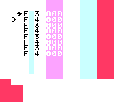

# Instrumentor

Music toy for GameBoy, made 2001. Pre-Little Sound Dj experiment. © [Johan Kotlinski](http://www.littlesounddj.com)



---

## Building

### Prerequisites

**[Install GBDK-2020](https://github.com/gbdk-2020/gbdk-2020/releases)**

### Building the ROM

**Using Make (macOS/Linux/Windows with make):**

```bash
make          # Build the ROM
make clean    # Clean build artifacts
make help     # Show available targets
```

**Using batch script (Windows without make):**

```cmd
make.bat
```

This will generate `dist/instrumentor.gb` which can be run in a GameBoy emulator.

### Testing

Use a GameBoy emulator:

- **SameBoy** (macOS): `brew install sameboy`
- **BGB** (Windows): [bgb.bircd.org/](https://bgb.bircd.org/)
- **mGBA** (Cross-platform): `brew install mgba`

---

## Controls

### Basic Controls

- **START** - Start/stop pattern playback
- **UP/DOWN** - Navigate between steps in the pattern
- **A + B** - Toggle erase/restore note at current step

### Editing Notes

- **B + UP/DOWN** - Change note pitch (C, C#, D, etc.)
- **A + UP/DOWN** - Change octave (0-5)

### Pattern

The instrument displays 8 steps of a repeating pattern. Each step shows:

- **>** - Current edit position
- **\*** - Currently playing step (during playback)
- Note and octave (e.g., "C 3", "D#4")
- Effect value (e.g., "M00" for modulation)
